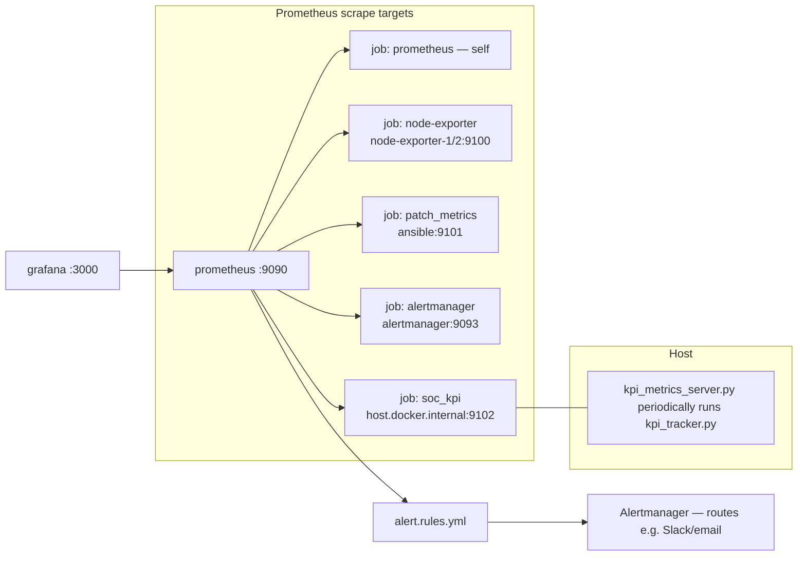
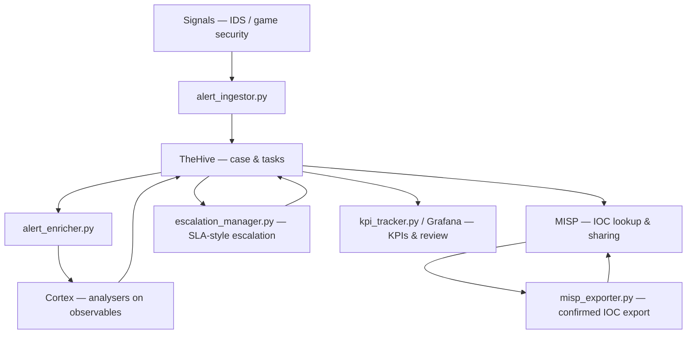

# Catnip Games SOC — Architecture

This document is the canonical **deployment and component view** for the platform: Docker Compose services (single `monitoring` bridge network), host-side Python automation, external data sources, and CI.

Rendered Mermaid diagrams display in GitHub and many Markdown viewers. To export a **static image** (PNG/SVG), use the [Mermaid CLI](https://github.com/mermaid-js/mermaid-cli) (`mmdc -i architecture_diagram.md`) or paste the fenced blocks into [mermaid.live](https://mermaid.live).

---

## 1. Component map (all services)

Containers and relationships match [`docker-compose.yml`](../../docker-compose.yml). Host tools live under `cortex/automation/` and related setup trees.

```mermaid
flowchart TB
  subgraph ext["External"]
    SRC["Game servers / IDS / simulated signals"]
    OPS["SOC analysts — web UI"]
    GHA["GitHub Actions — CI"]
  end

  subgraph host["SOC / developer host"]
    subgraph auto["Python automation — not containerized by default"]
      ING["alert_ingestor.py"]
      ENR["alert_enricher.py"]
      IOC["misp_exporter.py"]
      KPI["kpi_tracker.py"]
      KMS["kpi_metrics_server.py\n:9102 /metrics"]
      ESC["escalation_manager.py"]
    end
  end

  subgraph dc["Docker Compose — network: monitoring"]
    subgraph hive["Case management"]
      TH["thehive :9000"]
      CAS["cassandra"]
      TH --- CAS
    end

    subgraph cortexs["Enrichment engine"]
      CX["cortex :9001"]
      CDB["cortex-db — Elasticsearch 7"]
      CX --- CDB
    end

    subgraph mispg["Threat intelligence"]
      MI["misp :8080"]
      MDB["misp-db — MySQL 8"]
      RDIS["misp-redis"]
      MM["misp-modules"]
      MI --- MDB
      MI --- RDIS
      MI -. optional enrichment workers .- MM
    end

    subgraph mon["Metrics and dashboards"]
      PR["prometheus :9090"]
      AM["alertmanager :9093"]
      GF["grafana :3000"]
      GF --> PR
      PR --> AM
    end

    subgraph sim["Profile: sim — patch lab"]
      AX["ansible — patch orchestration\nmetrics :9101"]
      NE1["node-exporter-1 :9100"]
      NE2["node-exporter-2 :9100"]
      PT["patch-target-1 … 5 — SSH targets"]
      AX --> PT
    end

    PR -. scrape jobs per prometheus.yml .- NE1
    PR -. scrape .- NE2
    PR -. scrape .- AX
  end

  PR -. "job soc_kpi — host.docker.internal:9102" .-> KMS

  SRC --> ING
  ING --> TH
  ENR --> TH
  ENR --> CX
  IOC --> MI
  KPI --> TH
  ESC --> TH
  KMS -. invokes .- KPI
  OPS --> TH
  OPS --> MI
  OPS --> GF
  TH -.- CX
  GHA -. "CI: docker compose --profile sim up; gates" .-> PR
```

**Legend**

| Edge | Meaning |
|------|---------|
| TH — CAS | TheHive persists to Cassandra |
| TH -. CX | TheHive started with `--cortex-hostnames` so cases delegate analyser jobs to Cortex |
| ENR → TH / CX | `alert_enricher.py` reads cases from TheHive API and submits Cortex analyser jobs |
| ING → TH | `alert_ingestor.py` creates alerts/cases via TheHive API |
| IOC → MI | `misp_exporter.py` publishes IOCs to MISP |
| KPI / ESC → TH | Read case data via TheHive API |
| GF → PR | Grafana queries Prometheus |
| PR → AM | Prometheus sends firing alerts to Alertmanager |
| AX → PT | Ansible reaches simulated servers over Docker network |
| GHA → PR | GitHub Actions builds the sim profile, starts the stack, and runs patch validation gates |

**Bootstrap** — Initial org wiring and API keys use the Python scripts under `thehive/setup/`, `misp/setup/`, and `cortex/setup/` (invoked via `Makefile` targets such as `thehive-init`, `misp-setup`, `cortex-setup`).

---

## 2. Observability data flow

How Prometheus is wired (see [`prometheus/prometheus.yml`](../../prometheus/prometheus.yml)). The SOC KPI endpoint runs on the **host** so Prometheus uses `host.docker.internal:9102` (macOS/Windows-style Docker DNS).



---

## 3. Typical alert and response path (logical)

Operational sequence (see also [`docs/runbook/operational_runbook.md`](../runbook/operational_runbook.md)).



---

## Port reference

| Port | Component |
|------|-----------|
| 9000 | TheHive |
| 9001 | Cortex |
| 8080 | MISP (HTTP maps to container 80) |
| 9090 | Prometheus |
| 9093 | Alertmanager |
| 3000 | Grafana |
| 9100 | node-exporter (sim profile) |
| 9101 | Ansible patch metrics exporter (sim profile) |
| 9102 | kpi_metrics_server (host; scraped as `soc_kpi`) |

Infrastructure listeners without host publication: Cassandra CQL, Elasticsearch 9200, MySQL/Redis as used only inside the compose network.
